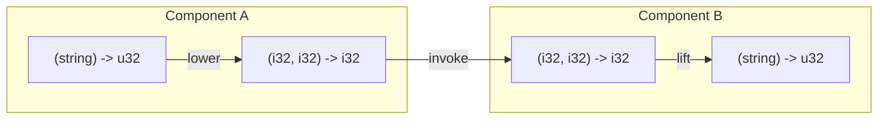
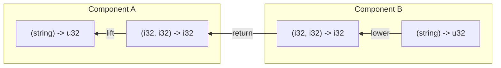

# Implementation notes on Canonical ABI

Component model defines a high-level interface between components. The interface defined by the WIT is mapped to the low-level core values and memory operations. The mapping is called the Canonical ABI.
The key idea of the Canonical ABI is to define a set of operations that can be used to translate between the WIT values and the core values.

Each WIT type has 2 key operations, [lift and lower](https://github.com/WebAssembly/component-model/blob/main/design/mvp/CanonicalABI.md#lifting-and-lowering-values):

- Lift: Translates core values to a WIT value.
- Lower: Translates a WIT value to core values.

Considering Component A and B, where A is calling a function exported by B that takes a string and returns an integer, the following diagram shows how the operations are used.

## Lifting

Lifting operation translates core values to a WIT value. It is used when calling a WIT-typed function from a core-typed function, or when returning a WIT value from a core-typed function. The operation can be split into 2 parts:

1. [Flat Lifting](https://github.com/WebAssembly/component-model/blob/main/design/mvp/CanonicalABI.md#flat-lifting): Translates a list of core values to a WIT value.
2. [Loading](https://github.com/WebAssembly/component-model/blob/main/design/mvp/CanonicalABI.md#loading): Reads a WIT value from the memory.

The loading operation is only used when the value is too large to be passed as a function argument, or too large to be returned from a function. Currently, the number of return value known as [`MAX_FLAT_RESULTS`](https://github.com/WebAssembly/component-model/blob/main/design/mvp/CanonicalABI.md#flattening) is limited to 1 in the core-level signature so that the Canonical ABI can be implemented without the multi-value proposal.

## Lowering

Lowering operation translates a WIT value to core values. It is used when calling a core-typed function from a WIT-typed function, or when returning a core value from a WIT-typed function. The operation can be split into 2 parts:

1. [Flat Lowering](https://github.com/WebAssembly/component-model/blob/main/design/mvp/CanonicalABI.md#flat-lowering): Translates a WIT value to a list of core values.
2. [Storing](https://github.com/WebAssembly/component-model/blob/main/design/mvp/CanonicalABI.md#storing): Writes a WIT value to the memory.

The same as the loading operation, the storing operation is only used when the WIT value is too large to be passed as a function argument, or too large to be returned from a function.

## Code sharing for static and dynamic operations

There are 3 places that the Canonical ABI needs to be implemented:

1. Code Generator: Statically generate the code for lifting and lowering at the Swift level for guest components and host runtime.
2. Host Runtime: Dynamically exchange the WIT values between guest components based on the given WIT definition at runtime.
3. AOT/JIT Compiler: Statically generate the code for lifting and lowering with the given WIT definition at runtime.

To reduce the code duplication and maintenance cost, WasmKit uses the same ABI modeling code that describes the essential logic of each lifting, lowering, loading, and storing operation in abstract ways. (See [`Sources/WIT/CanonicalABI/`](../../Sources/WIT/CanonicalABI))

The ABI modeling code is designed to be used in both static and dynamic contexts. In the static context, each operation is performed at the meta-level, which means the operation is not actually executed but only used to construct the sequence of instructions. In the dynamic context, the operation is actually executed.
